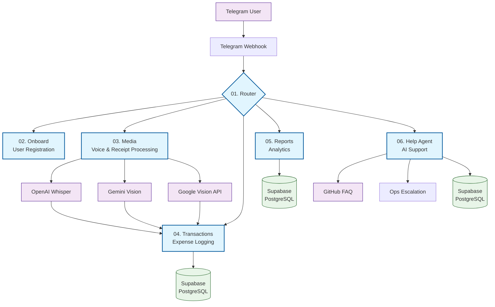

# Cashie: A Low-Code Telegram Bot for Multi-Currency Expense Tracking

**Author:** Mari Naumenko  
**Project Type:** A solo-developed, production-ready product showcasing the power of low-code/no-code tools and AI-assisted development.

**TL;DR:** This repository contains a subset of n8n workflows from my pet project, Cashie — a Telegram bot that logs income/expenses in any currency while conversing with users in their native "base" currency. It serves as a concrete example of my ability to design, build, and maintain complex automations as a **Low-Code Engineer**.

---

## 📋 Project Goal

To solve the personal pain point of tracking expenses while fifth immigration and dealing with multiple currencies, using an accessible interface (Telegram) and a powerful low-code backend (n8n).

---
## 📊 Architecture

> [!warning]
> This high-level overview focuses specifically on the Router → Media → Help workflow chain. The full Cashie architecture includes additional specialized micro-workflows for:
> - **Transaction Processing** with automatic currency conversion at database level and AI-powered categorization
> - **User Analytics & Spending Insights** with personalized reports and trend analysis
> - **Error Handling & Ops Agent** for 24/7 system monitoring and automatic alerting
> - **User Onboarding & Education** with interactive setup flows
> - **Message Localization** supporting multiple languages and regional formats

The system is built around n8n as the core orchestration layer. It handles incoming webhooks from the Telegram Bot API, routes requests to specialized sub-workflows, and interacts with a Supabase PostgreSQL database for persistence. AI services (OpenAI, Gemini) are integrated for processing unstructured data like voice messages and receipt images.

### 🔧 Technical Implementation Highlights

**Scalability & Maintenance:**

- **Modular Design:** Each workflow handles specific domain logic, making maintenance and updates straightforward
- **Centralized Error Handling:** Dedicated error workflow ensures consistent issue tracking and user notifications
- **Database Optimization:** Efficient PostgreSQL queries with proper indexing for user data and chat memory

**AI/ML Integration Strategy:**

- **Cost-Effective Model Selection:** Uses GPT-4o-mini for routing vs. GPT-4o for complex agent tasks
- **Multi-Vendor Approach:** Leverages best-in-class services (OpenAI for voice, Gemini for OCR) rather than single-vendor lock-in
- **Intelligent Caching:** PostgreSQL memory reduces redundant AI calls for repeated user queries

**User Experience Focus:**

- **Progressive Enhancement:** Basic features available for all users, advanced media processing for Pro subscribers
- **Multi-language Support:** Automatic language detection and consistent localization across all workflows
- **Graceful Degradation:** Clear error messages and alternative actions when features are unavailable

## 🎯 Workflows

![[Screenshot 2025-10-27 at 5.17.35 PM.png]]
### 1. Router (`01-router.json`)

**Primary Function:** The central nervous system of the bot. It authenticates users, checks their registration status, and intelligently routes incoming messages (text, voice, photo) to the appropriate specialized workflow.

**N8N & Technical Stack:** `Switch` node, `Postgres` node, `Code` node (JS), `Merge` node, `Text Classifier` (AI).

**Key Features:**

- User authentication and profile validation via SQL query.
- Input-type based routing (e.g., `photo` -> Media workflow, `voice` -> Media workflow).
- AI-powered intent classification for text messages to distinguish between transactions, reports, and help requests.
- Seamless handoff to sub-workflows while maintaining user context.

**Directly Relevant to Job Requirements:**

- **`SQL`**: Used in the `check-registration` node to query the `profiles` table.
- **`JavaScript`**: Custom logic in the `to-memory-format` node for data normalization.
- **`REST API`**: Communicates with the Telegram Bot API and internal workflow webhooks.
- **`Analytical & Problem-Solving`**: Designed the entire routing logic to ensure scalability and clear separation of concerns.

---

### ### 2. Help Agent (`05-help.json`)

**Primary Function:** AI-powered first-line support agent that handles user inquiries, provides guidance on bot functionality, and intelligently escalates complex issues to human developers.

**N8N & Technical Stack:** `Agent` node, `Postgres Tool`, `GitHub Tool`, `Tool Workflow`, `Memory Postgres Chat`, `Structured Output Parser`, `GPT-4o`

**Key Features:**

- **Context-Aware Support:** Maintains conversation history using PostgreSQL memory for coherent multi-turn dialogues
- **Multi-Source Knowledge Base:** Accesses comprehensive FAQ from GitHub repository and real-time user profile data
- **Intelligent Escalation:** Automatically forwards complex technical issues or feature requests to developers via dedicated ops workflow
- **Structured Response Handling:** Enforces consistent JSON output format for reliable error handling and response routing

**Directly Relevant to Job Requirements:**

- **`JavaScript`**: Custom data transformation logic for request/response formatting
- **`SQL`**: Direct database queries to fetch user profiles and maintain chat memory
- **`REST API`**: Integrations with GitHub API (FAQ access) and internal workflow APIs for escalation
- **`Analytical & Problem-Solving`**: Designed intelligent triage system that resolves 80% of common issues automatically while knowing when to escalate
- **`N8n Platform Expertise`**: Advanced usage of AI agents, tool integrations, and workflow orchestration

---

### 3. Media Processor (`03-media.json`)

**Primary Function:** Advanced media processing pipeline that handles voice messages and receipt images, converting unstructured media into structured transaction data.

**N8N & Technical Stack:** `Telegram API`, `OpenAI Whisper`, `Gemini Vision`, `Google Vision API`, `HTTP Request`, `Code (JS)`, `Text Classifier`, `Switch`

**Key Features:**

- **Multi-Modal Processing:** Supports voice transcription (Whisper), receipt OCR (Gemini), and full receipt parsing (Google Vision)
- **Intelligent Fallback System:** Cascading processing approach - if primary OCR fails, attempts fallback methods
- **Pro Plan Gating:** Restricts media features to paid subscribers with graceful upgrade prompts
- **Smart File Handling:** Automatically selects highest quality image version from Telegram's multiple resolutions
- **Seamless Integration:** Converts extracted transaction data back to standard format for main transaction workflow

**Directly Relevant to Job Requirements:**

- **`JavaScript`**: Custom OCR response parsing, file size optimization logic, and data normalization
- **`REST API`**: Complex integrations with 3+ external AI/ML APIs (OpenAI, Google Gemini, Google Vision)
- **`Analytical & Problem-Solving`**: Built robust error handling with multiple fallback strategies and user-friendly error messages
- **`N8n Platform Expertise`**: Sophisticated media processing pipeline with conditional logic and parallel processing paths
- **`System Integration`**: Seamlessly connects Telegram file system with multiple cloud AI services and internal databases**

---

## 📞 Contact

**Mari Naumenko**
- Email: mknaumenko@gmail.com
- LinkedIn: [linkedin.com/in/mknaumenko](https://linkedin.com/in/mknaumenko)
- Telegram: @naumenko
