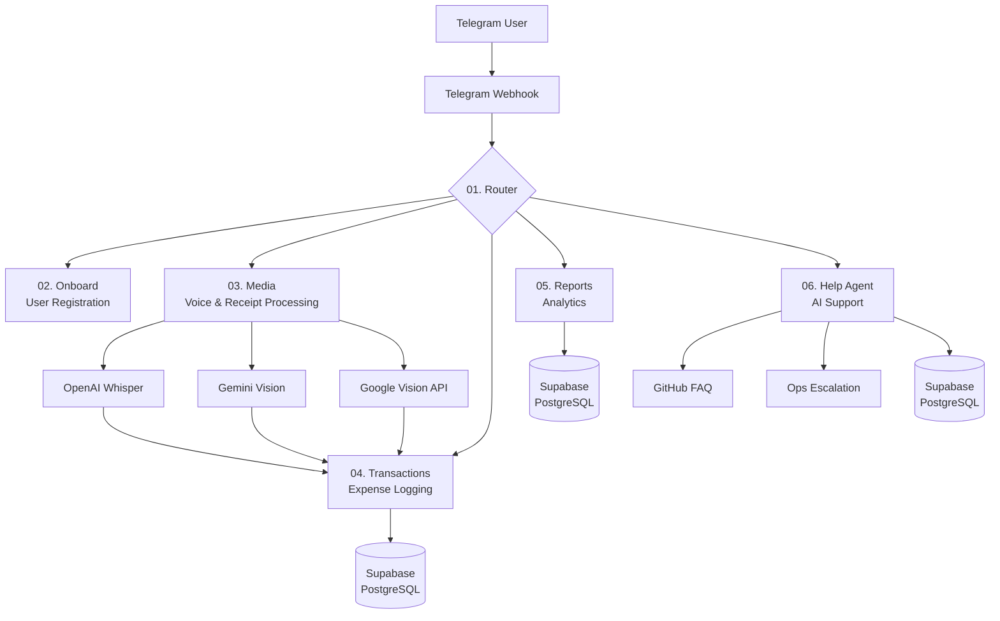

# Cashie: A Low-Code Telegram Bot for Multi-Currency Expense Tracking

Author: Mari Naumenko  
Project Type: A solo-developed, production-ready product built with low-code/no-code tools and AI-assisted development.

TL;DR: This repository contains a subset of n8n workflows from my pet project, Cashie — a Telegram bot that logs income/expenses in any currency while conversing with users in their native "base" currency. It demonstrates my experience designing and maintaining complex automations using low-code tools.

---

## Project Goal

To solve the practical problem of tracking expenses across multiple currencies during relocation, using an accessible interface (Telegram bot + Telegram Mini-app) and a low-code backend (n8n).

---

## Architecture

Note: This high-level overview focuses specifically on the Router, Media, Help workflows. The full Cashie architecture includes additional specialized micro-workflows for:
- Transaction Processing with automatic currency conversion at database level and AI-based categorization
- User Analytics & Spending Insights with personalized reports and spending trends
- Error Handling & Ops Agent for automated system monitoring and alerting
- User Onboarding & Education with guided setup flows
- Message Localization supporting multiple languages and regional formats

The system is built around n8n as the core orchestration layer. It handles incoming webhooks from the Telegram Bot API, routes requests to specialized sub-workflows, and interacts with a Supabase PostgreSQL database for persistence. AI services (OpenAI, Gemini) handle unstructured inputs such as voice messages and receipts.

### Technical Implementation Highlights

Scalability & Maintenance:

- Modular Design: Each workflow handles specific domain logic, simplifying maintenance and updates
- Centralized Error Handling: Dedicated error workflow for tracking issues and notifying users
- Database Optimization: Efficient PostgreSQL queries with proper indexing for user data and chat memory

AI/ML Integration Strategy:

- Cost-Effective Model Selection: Uses GPT-4o-mini for routing vs. GPT-4o for complex agent tasks
- Multi-Vendor Approach: Uses multiple providers (OpenAI for voice, Gemini for OCR) to avoid vendor lock-in
- Result Caching: PostgreSQL memory reduces redundant AI calls for repeated user queries

User Experience Focus:

- Progressive Enhancement: Basic features available for all users, advanced media processing for Pro subscribers
- Multi-language Support: Automatic language detection and consistent localization across all workflows
- Fallback Handling: Clear error messages and alternative actions when features are unavailable

## Workflows

### Router (01-router.json)

Primary Function: The main routing layer of the bot. It authenticates users, checks their registration status, and routes incoming messages based on type (text, voice, photo) to the appropriate specialized workflow.

N8N & Technical Stack: Switch node, Postgres node, Code node (JS), Merge node, Text Classifier (AI).

Key Features:

- User authentication and profile validation via SQL query.
- Input-type based routing (e.g., photo -> Media workflow, voice -> Media workflow).
- AI-based intent classification for text messages to distinguish between transactions, reports, and help requests.
- Handoff to sub-workflows while maintaining user context.

### Help Agent (05-help.json)

Primary Function: AI-based support agent that handles user inquiries, provides guidance on bot functionality, and automatically escalates complex issues to human developers.

N8N & Technical Stack: Agent node, Postgres Tool, GitHub Tool, Tool Workflow, Memory Postgres Chat, Structured Output Parser, GPT-4o

Key Features:

- Contextual Support: Maintains conversation history using PostgreSQL memory for coherent multi-turn dialogues
- Multi-Source Knowledge Base: Accesses comprehensive FAQ from GitHub repository and real-time user profile data
- Automatic Escalation: Forwards complex technical issues or feature requests to developers via dedicated ops workflow
- Structured Response Handling: Enforces consistent JSON output format for reliable error handling and response routing

### Media Processor (03-media.json)

Primary Function: Media processing workflow that handles voice messages and receipt images, converting unstructured media into structured transaction data.

N8N & Technical Stack: Telegram API, OpenAI Whisper, Gemini Vision, Google Vision API, HTTP Request, Code (JS), Text Classifier, Switch

Key Features:

- Multi-Modal Processing: Supports voice transcription (Whisper), receipt OCR (Gemini), and full receipt parsing (Google Vision)
- Fallback System: Cascading processing approach - if primary OCR fails, attempts fallback methods
- Feature Gating (Pro tier): Restricts media features to paid subscribers with graceful upgrade prompts
- Automatic File Handling: Selects highest quality image version from Telegram's multiple resolutions
- Integration with the main transaction workflow: Converts extracted transaction data back to standard format

---

## Contact

Mari Naumenko
- Email: mknaumenko@gmail.com
- LinkedIn: linkedin.com/in/mknaumenko
- Telegram: @naumenko